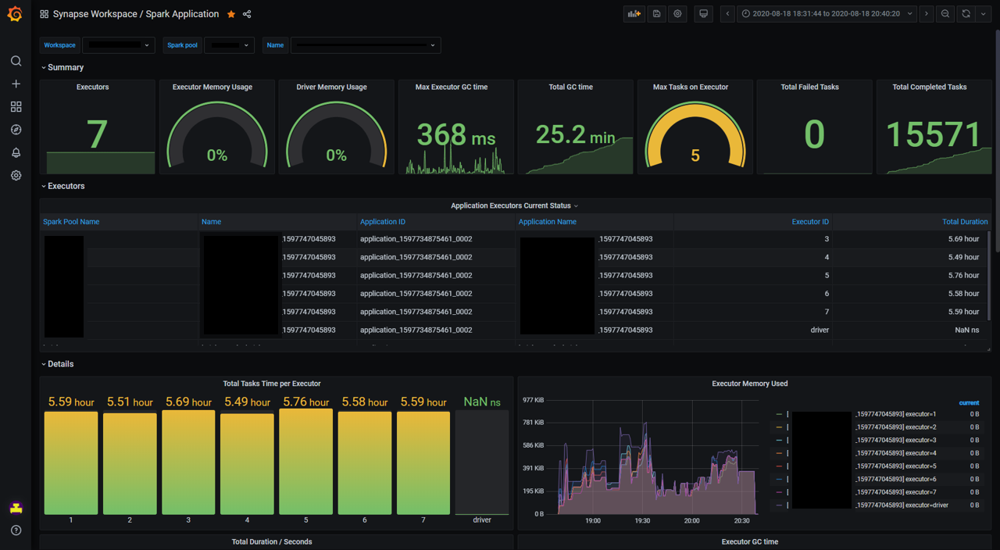

# Azure Synapse Spark Metrics

## Introduction

This project mainly aims to provide:
 - **Azure Synapse Apache Spark metrics** monitoring for Azure Synapse Spark applications by leveraging Prometheus, Grafana and Azure APIs.
 - **Azure Synapse Prometheus connector** for connecting the on-premises Prometheus server to Azure Synapse Analytics workspace metrics API. 
 - **Grafana dashboards** for synapse spark metrics visualization.
 - **Helm chart** for Prometheus and Grafana deployment on AKS, including the connector, Prometheus servers and Grafana dashboards for metrics users.

The dataflow:


Grafana dashboard screenshot:



## Prerequisites

1. [Azure CLI](https://docs.microsoft.com/en-us/cli/azure/install-azure-cli?view=azure-cli-latest)
2. [Helm 3.30+](https://github.com/helm/helm/releases)
3. [kubectl](https://kubernetes.io/docs/tasks/tools/install-kubectl/)

Or just use the out-of-box [Azure Cloud Shell](https://shell.azure.com/), which includes all above tools.

## Getting Started

1. Create a Azure Kubernetes (1.16+, or use Minikube instead)

    ```bash
    az login
    az account set --subscription "<subscription_id>"
    az aks create --name <kubernetes_cluster_name> --resource-group <kubernetes_cluster_rg> --location eastus --node-vm-size Standard_D2s_v3
    az aks get-credentials --name <kubernetes_cluster_name> --resource-group <kubernetes_cluster_rg>
    ```

2. Create a service principal and grant permission to synapse workspace

    ```bash
    az ad sp create-for-rbac --name <service_principal_name>
    ```

    The result should look like:

    ```json
    {
        "appId": "abcdef...",
        "displayName": "<service_principal_name>",
        "name": "http://<service_principal_name>",
        "password": "abc....",
        "tenant": "<tenant_id>"
    }
    ```

    Note down the appId, password, and tenant id.

    1. Login to your [Azure Synapse Analytics workspace](https://web.azuresynapse.net/) as Synapse Administrator
    2. In Synapse Studio, on the left-side pane, select **Manage** > **Access control**
    3. Click the **Add** button on the upper left to add a role assignment
    4. For **Scope** choose **Workspace**
    5. For **Role** choose **Synapse Compute Operator**
    6. For **Select user** input your <service_principal_name> and click your service principal
    7. Click **Apply**

    Wait 3 minutes for permission to take effect.

    

    > Note: Make sure your service principal has at least a "Reader" role in your Synapse workspace. Go to **Access Control (IAM)** tab of the Azure portal and check the permission settings.

3. Install Synapse Prometheus Operator

    Add synapse-prometheus-operator repo to Helm client

    ```bash
    helm repo add synapse-charts https://github.com/microsoft/azure-synapse-spark-metrics/releases/download/helm-chart
    ```

    Install by Helm client:

    ```bash
    helm install spo synapse-charts/synapse-prometheus-operator --create-namespace --namespace spo \
        --set synapse.workspaces[0].workspace_name="<workspace_name>" \
        --set synapse.workspaces[0].tenant_id="<tenant_id>" \
        --set synapse.workspaces[0].service_principal_name="<service_principal_app_id>" \
        --set synapse.workspaces[0].service_principal_password="<service_principal_password>" \
        --set synapse.workspaces[0].subscription_id="<subscription_id>" \
        --set synapse.workspaces[0].resource_group="<workspace_resource_group_name>"
    ```

     - workspace_name: Synapse workspace name.
     - subscription_id: Synapse workspace subscription id.
     - workspace_resource_group_name:  Synapse workspace resource group name.
     - tenant_id: Synapse workspace tenant id.
     - service_principal_name: The service principal name (or known as "appId")
     - service_principal_password: The service principal password you just created.

    For more details, please refer to [config.example.yaml](https://github.com/microsoft/azure-synapse-spark-metrics/blob/main/synapse-prometheus-connector/src/config/config.example.yaml)

4. Open Grafana and enjoy!

    ```bash
    # Get password
    kubectl get secret --namespace spo spo-grafana -o jsonpath="{.data.admin-password}" | base64 --decode ; echo
    # Get service ip, copy & paste the external ip to browser, and login with username 'admin' and the password.
    kubectl -n spo get svc spo-grafana
    ```

    Find Synapse Dashboard on the upper left corner of the Grafana page (Home -> Synapse Workspace / Synapse Application),
    try to run a example code in Synapse Studio notebook and wait a few seconds for the metrics pulling.

## Uninstall

Remove the operators.

```bash
# helm delete <release> -n <namespace>
helm delete spo -n spo
```

Remove the Kubernetes cluster.

```bash
az aks delete --name <kubernetes_cluster_name> --resource-group <kubernetes_cluster_rg>
```

## Build Docker Image

```bash
cd synapse-prometheus-connector
docker build -t "synapse-prometheus-connector:${Version}" -f Dockerfile .
```

## Contributing

This project welcomes contributions and suggestions.  Most contributions require you to agree to a
Contributor License Agreement (CLA) declaring that you have the right to, and actually do, grant us
the rights to use your contribution. For details, visit https://cla.opensource.microsoft.com.

When you submit a pull request, a CLA bot will automatically determine whether you need to provide
a CLA and decorate the PR appropriately (e.g., status check, comment). Simply follow the instructions
provided by the bot. You will only need to do this once across all repos using our CLA.

This project has adopted the [Microsoft Open Source Code of Conduct](https://opensource.microsoft.com/codeofconduct/).
For more information see the [Code of Conduct FAQ](https://opensource.microsoft.com/codeofconduct/faq/) or
contact [opencode@microsoft.com](mailto:opencode@microsoft.com) with any additional questions or comments.
